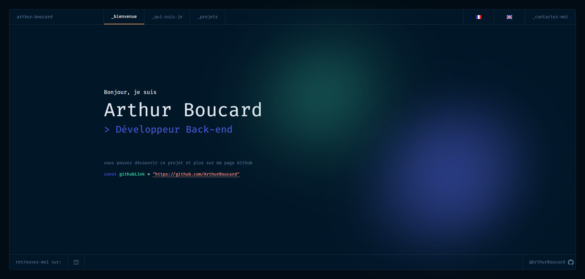

<h1 align="center">
  developer-portfolio-v2
</h1>

  The first open source version of <a href="https://www.figma.com/community/file/1100794861710979147" target="_blank"> Portfolio for Developers Concept V.2</a>, designed by <a href="https://www.behance.net/darelova" target="_blank">@darelova</a> and developed by <a href="https://github.com/alexdeploy">@alexdeploy</a>. Built with <a href="https://nuxt.com/" target="_blank">Nuxt.js 3.0</a>

<h2 align="center">
  This my personal modification of this portfolio made by those 2 people, feel free to check out their work
</h2>

  

## 🚨 Credits

Credits to the designer <a href="https://www.behance.net/darelova" target="_blank">@darelova</a> and the developer <a href="https://github.com/alexdeploy">@alexdeploy</a>, link to the repo .
